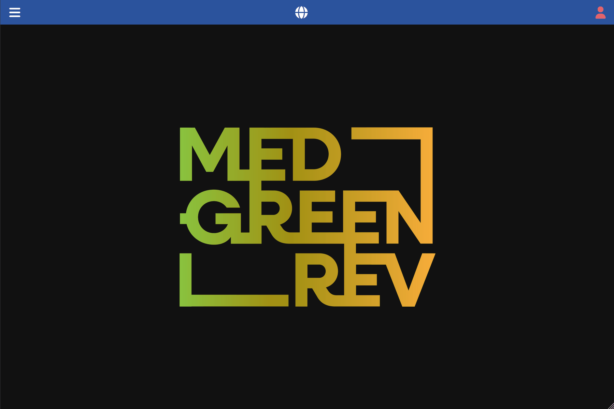

[Back to User Documentation](index.md)

# Admin Documentation

This document provides instructions for administrative tasks in the MEDGREENREV system.

## User Management

Only users with `ROLE_ADMIN` can manage other users. Note that an administrator cannot perform these actions on their own account.

### Creating a New User

To create a new user, follow these steps:

1. Navigate to the User management section using the left navigation menu.
2. Click on the "..." button on the top right corner of the table.
3. Select "add new" button.
4. Fill in the required fields: email, roles, etc. Password is automatically generated and must be provided to the user.
5. Associate the user with one or more sites to grant them editing permissions.

### Resetting a User Password

If a user forgets their password, an administrator can reset it:

1. Locate the user in the User management list.
2. Click on the rotating arrows icon at the left of the user row.
3. Password will be reset and the new one must be provided to the user.

