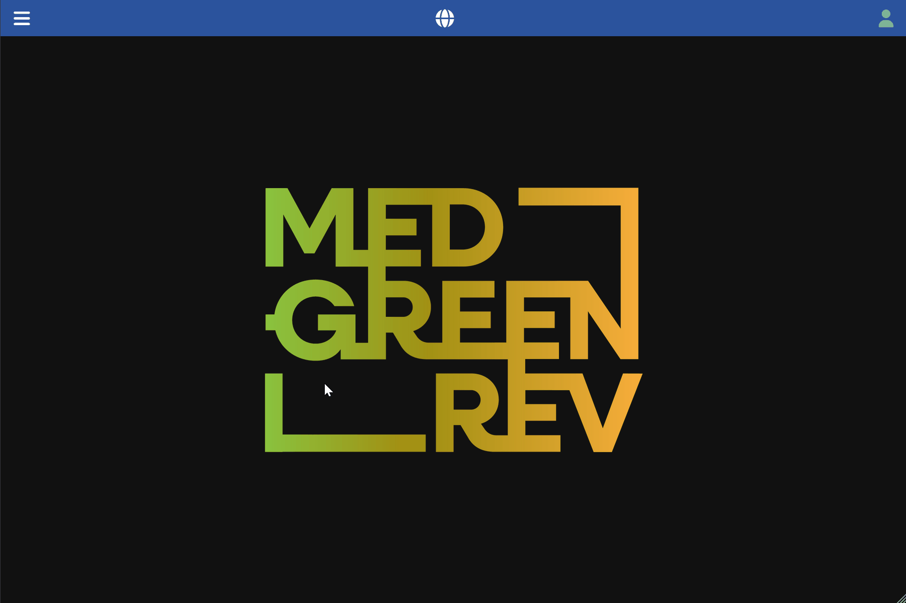

[Back to User Documentation](index.md)

# Analyses Management

This document describes how analyses are managed within the MEDGREENREV system.

## Table of Contents

- [Overview](#overview)
  - [Specimen Analyses](#specimen-analyses)
  - [Assemblage Analyses](#assemblage-analyses)
- [Analysis creation](#analysis-creation)
  - [Permissions](#permissions)
  - [Procedure](#procedure)
  - [Visual Guide](#visual-guide)
- [Analysis association](#analysis-association)
  - [Specimen Analysis Association](#specimen-analysis-association)
    - [Permissions](#permissions-1)
    - [Procedure](#procedure-1)
    - [Visual Guide](#visual-guide-1)
  - [Absolute Dating Analysis Association](#absolute-dating-analysis-association)
    - [Permissions](#permissions-2)
    - [Procedure](#procedure-2)
    - [Visual Guide](#visual-guide-2)
  - [Assemblage Analysis Association](#assemblage-analysis-association)
    - [Permissions](#permissions-3)
    - [Procedure](#procedure-3)
    - [Visual Guide](#visual-guide-3)
  - [Archaeobotanical Assemblage Analysis Association](#archaeobotanical-assemblage-analysis-association)
      - [Permissions](#permissions-5)
      - [Procedure](#procedure-5)
      - [Visual Guide](#visual-guide-5)
  - [Zooarchaeological Assemblage Analysis Association](#zooarchaeological-assemblage-analysis-association)
    - [Permissions](#permissions-4)
    - [Procedure](#procedure-4)
    - [Visual Guide](#visual-guide-4)
  - [Microstratigraphic Analysis Association](#microstratigraphic-analysis-association)
      - [Permissions](#permissions-6)
      - [Procedure](#procedure-6)
      - [Visual Guide](#visual-guide-6)

## Overview

The system provides a flexible structure for associating analyses with one or more entities, depending on the scope and focus of each study. Specific or targeted analyses — such as ORA, aDNA, or microscopy — can be linked directly to the particular element under study (e.g., an animal bone or tooth, a human deposit or individual, or a ceramic find). For analyses that are meaningful only at a broader, aggregated level, the system allows them to be associated with entities representing a relevant level of aggregation. For instance, zooarchaeological studies can be associated with contexts (arbitrary groupings of stratigraphic units with archaeological significance), while anthropological analyses can be associated with the site as a whole.

The system distinguishes between two main categories of analysis: **Specimen Analyses** and **Assemblage Analyses**.

### Specimen Analyses

Specimen analyses target a specific find or element. They are grouped by analytical technique:

| Group | Code | Analysis | Allowed Association |
|---|---|---|---|
| **Absolute Dating** | C14 | C14 | Pottery, Individual, Botany Seed, Botany Charcoal, Zoo Bone, Zoo Tooth, Sample, Sediment Core Depth |
| | THL | Thermoluminescence | Pottery, Individual, Botany Seed, Botany Charcoal, Zoo Bone, Zoo Tooth, Sample, Sediment Core Depth |
| | OSL | Optical Simulated Luminescence | Pottery, Individual, Botany Seed, Botany Charcoal, Zoo Bone, Zoo Tooth, Sample, Sediment Core Depth |
| **Material Analysis** | ADNA | aDNA | Pottery, Individual, Botany Seed, Botany Charcoal, Zoo Bone, Zoo Tooth, Sample, Sediment Core Depth |
| | GEO | Geochemistry | Pottery, Individual, Botany Seed, Botany Charcoal, Zoo Bone, Zoo Tooth, Sample, Sediment Core Depth |
| | ISO | Isotopes | Pottery, Individual, Botany Seed, Botany Charcoal, Zoo Bone, Zoo Tooth, Sample, Sediment Core Depth |
| | ORA | ORA | Pottery, Individual, Botany Seed, Botany Charcoal, Zoo Bone, Zoo Tooth, Sample, Sediment Core Depth |
| | XRF | XRF | Pottery, Individual, Botany Seed, Botany Charcoal, Zoo Bone, Zoo Tooth, Sample, Sediment Core Depth |
| | XRD | XRD | Pottery, Individual, Botany Seed, Botany Charcoal, Zoo Bone, Zoo Tooth, Sample, Sediment Core Depth |
| **Micromorphology** | THS | Thin Section | Sample (Microstratigraphy) |
| **Microscope** | OPT | Optical | Pottery, Individual, Botany Seed, Botany Charcoal, Zoo Bone, Zoo Tooth, Sediment Core Depth |
| | SEM | SEM | Pottery, Individual, Botany Seed, Botany Charcoal, Zoo Bone, Zoo Tooth, Sediment Core Depth |

### Assemblage Analyses

Assemblage analyses operate at an aggregated level, associated with contexts, samples, sediment core depths, or the site as a whole rather than individual specimens:

| Sub-group | Code | Analysis | Allowed Association |
|---|---|---|---|
| **Anthropology** | ANTH | Anthropology | Site (Anthropology) |
| **Zooarchaeology** | ZOO | Zooarchaeology | Context (Zoo) |
| **Botany** | ANTX | Anthracology | Context (Botany) |
| | CARP | Carpology | Context (Botany) |
| | PHY | Phytoliths | Sample (Botany), Sediment Core Depth (Botany) |
| | POL | Pollen | Sample (Botany), Sediment Core Depth (Botany) |
| | SDNA | Sedimentary DNA | Sample (Botany), Sediment Core Depth (Botany) |

## Analysis creation

### Permissions

As an authenticated user, with a specialist role, you can create new analyses. See the [Authorization](authorization.md#analysis-records) document for more information.

### Procedure

1.  Navigate to the **Analyses / Analyses** section using the left-hand navigation menu.
2.  Click the vertical **...** button in the top bar and select the **add new** option in the dropdown menu.
3.  Fill in the form, keeping in mind the required fields and any validation rules.
    The **Code** field is automatically generated concatenating the `type` code, the `year` last two digits, and the `identifier` (e.g. in the example below it will be `THS.26.TO.1`). 
4.  Click the **Submit** button.

### Visual Guide

The following GIF demonstrates the process:

## Analysis association

You can associate analyses with any entity that is relevant to the study. The allowed associations are listed in the tables above.

### Specimen Analysis Association

#### Permissions

To be able to associate an analysis with a specimen (Pottery, Individual, Botany, Zoo, Sample, etc.), the user must have the appropriate [permissions](authorization.md#specialist-data-items-botany-zoo-pottery-etc) for the specimen's site, and the user must have a specialist role corresponding to the specimen type (e.g. `potteryst` for Pottery, `zooarchaeologist` for Zoo Bone/Tooth, etc.).

#### Procedure

1. Navigate to the specimen's details page.
2. Select the **Analyses** tab.
3. Click the vertical **...** button in the top bar of the tab and select the **add new** option in the dropdown menu.
4. Fill in the form, keeping in mind the required fields and any validation rules.
   The `analysis` field is mandatory and must exist beforehand the association creation. Analysis is chosen from a dropdown list containing all the compatible analyses in the system. You can filter the list by typing a few letters/numbers of the analysis code.
5. Click the **Submit** button.

#### Visual Guide

The following GIF demonstrates the process:

### Absolute Dating Analysis Association

#### Permissions

To be able to associate an absolute dating analysis with a specimen (Pottery, Individual, Botany, Zoo, Sample, etc.), the user must have the appropriate [permissions](authorization.md#specialist-data-items-botany-zoo-pottery-etc) for the specimen's site, and the user must have a specialist role corresponding to the specimen type (e.g. `potteryst` for Pottery, `zooarchaeologist` for Zoo Bone/Tooth, etc.).

#### Procedure

1. Navigate to the specimen's details page.
2. Select the **Analyses** tab.
3. Click the vertical **...** button in the top bar of the tab and select the **add new** option in the dropdown menu.
4. Fill in the form, keeping in mind the required fields and any validation rules.
   The `analysis` field is mandatory and must exist beforehand the association creation. Analysis is chosen from a dropdown list containing all the compatible analyses in the system. You can filter the list by typing a few letters/numbers of the analysis code.
   If the selected analysis belongs to the **absolute dating** group (C14, THL, OSL), an **Absolute dating data** checkbox will appear. Clicking it will open a secondary form where you can enter the specific dating results.
5. Click the **Submit** button.

#### Visual Guide

The following GIF demonstrates the process:

### Assemblage Analysis Association

#### Permissions

To be able to associate an assemblage analysis with a resource (Site, Context, Sample, etc.), the user must have the appropriate [permissions](authorization.md#specialist-data-items-botany-zoo-pottery-etc) for the resource's site, and the user must have a specialist role corresponding to the assemblage type (e.g. `zooarchaeologist` for Context (Zoo), `archaeobotanist` for Context (Botany), etc.).

#### Procedure

1. Navigate to the resource's details page (Site, Context, Sample, or Sediment Core Depth).
2. Select the correct **Analyses** tab depending on the resource type (e.g. **Analyses** for Samples or **Anthropological analyses** for Sites).
3. Click the vertical **...** button in the top bar of the tab and select the **add new** option in the dropdown menu.
4. Fill in the form, keeping in mind the required fields and any validation rules.
   The `analysis` field is mandatory and must exist beforehand the association creation. Analysis is chosen from a dropdown list containing all the compatible analyses in the system. You can filter the list by typing a few letters/numbers of the analysis code.
5. Click the **Submit** button.

#### Visual Guide

The following GIF demonstrates the process:

### Zooarchaeological Assemblage Analysis Association

#### Permissions

To be able to associate a zooarchaeological assemblage analysis with a context, the user must have the appropriate [permissions](authorization.md#specialist-data-items-botany-zoo-pottery-etc) for the context's site, and the user must have the `zooarchaeologist` role.

#### Procedure

1. Navigate to the context's details page.
2. Select the **Analyses** tab.
3. Click the vertical **...** button in the top bar of the tab and select the **add new** option in the dropdown menu.
4. Fill in the form, keeping in mind the required fields and any validation rules.
   The `analysis` field is mandatory and must exist beforehand the association creation. Analysis is chosen from a dropdown list containing all the compatible analyses in the system. You can filter the list by typing a few letters/numbers of the analysis code.
5. Select the most relevant taxa found in the given context by using the dropdown checkable menu.
6. Click the **Submit** button.

#### Visual Guide

The following GIF demonstrates the process:

### Archaeobotanical Assemblage Analysis Association

#### Permissions

To be able to associate an archaeobotanical assemblage analysis with a resource (Context, Sample, etc.), the user must have the appropriate [permissions](authorization.md#specialist-data-items-botany-zoo-pottery-etc) for the resource's site, and the user must have the `archaeobotanist` role.

#### Procedure

1. Navigate to the resource's details page (Context, Sample, or Sediment Core Depth).
2. Select the **Analyses** tab.
3. Click the vertical **...** button in the top bar of the tab and select the **add new** option in the dropdown menu.
4. Fill in the form, keeping in mind the required fields and any validation rules.
   The `analysis` field is mandatory and must exist beforehand the association creation. Analysis is chosen from a dropdown list containing all the compatible analyses in the system. You can filter the list by typing a few letters/numbers of the analysis code.
5. Click the **Submit** button.
6. In the association item page, specify the most relevant taxa found in the context/sample.

#### Visual Guide

The following GIF demonstrates the process:

### Microstratigraphic Analysis Association

#### Permissions

To be able to associate a microstratigraphic analysis with a sample, the user must have the appropriate [permissions](authorization.md#specialist-data-items-botany-zoo-pottery-etc) for the sample's site, and the user must have the `microstratigraphist` role.

#### Procedure

1. Navigate to the sample's details page, using either the **Data / Archaeology / Samples**, possibly filtering it with the search bar,
   or in the parent site's detail page in the sample tab.
2. Select the **Samples** tab.
3. Click the vertical **...** button in the top bar of the tab and select the **add new** option in the dropdown menu.
4. Fill in the form, keeping in mind the required fields and any validation rules.
   The `analysis` field is mandatory and must exist beforehand the association creation. Analysis is chosen from a dropdown list containing all the microstratigraphic analysis in the system. You can filter the list by typing a few letters/numbers of the analysis code.
5. Click the **Submit** button.

#### Visual Guide

The following GIF demonstrates the process:

