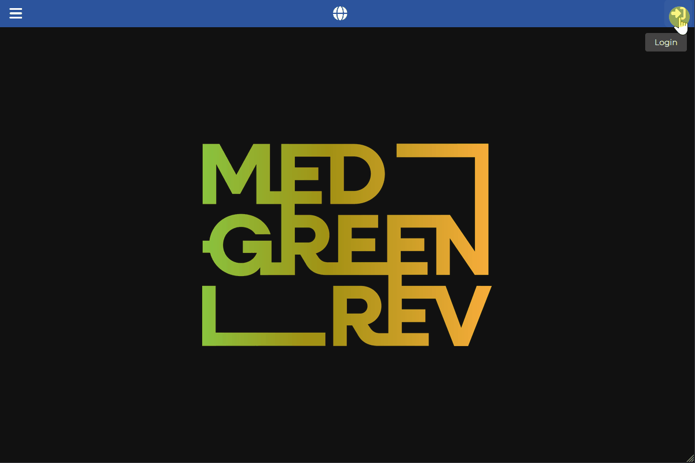

[Back to User Documentation](index.md)

# Change Password

This document describes how an authenticated user can change their password within the MEDGREENREV system.

## Workflow

To change your password, follow these steps:

1. Log in to the application.
2. Open the user menu by clicking on the profile icon in the top right corner of the main toolbar.
3. Click on the username entry in the menu to navigate to the settings page.
4. On the settings page, click the three vertical dots (`...`) in the top right corner.
5. Select **Change password** from the dropdown menu to open the change password dialog.
6. Enter your current password in the **Old password** field.
7. Enter your new password in the **New password** field, ensuring it conforms to the required password rules.
8. Re-enter your new password in the **Repeat password** field to confirm it.
9. Click the submit button to save your new password.

### Password Rules

The new password must conform to the following security rules:

* **Required**: The password cannot be blank.
* **Length**: Must be at least 8 characters and no more than 20 characters long.
* **Uppercase letter**: Must contain at least one uppercase letter (`A-Z`).
* **Lowercase letter**: Must contain at least one lowercase letter (`a-z`).
* **Digit**: Must contain at least one numeric digit (`0-9`).
* **Special character**: Must contain at least one special character (e.g., `!`, `@`, `#`, `$`, `_`, etc.).
* **Matching confirmation**: The repeat password must match the new password exactly.

> **Tip**: You can toggle visibility for any password field by clicking the eye icon at the right end of the input box.

## Visual Guide

The following GIF demonstrates the process of changing your password:

