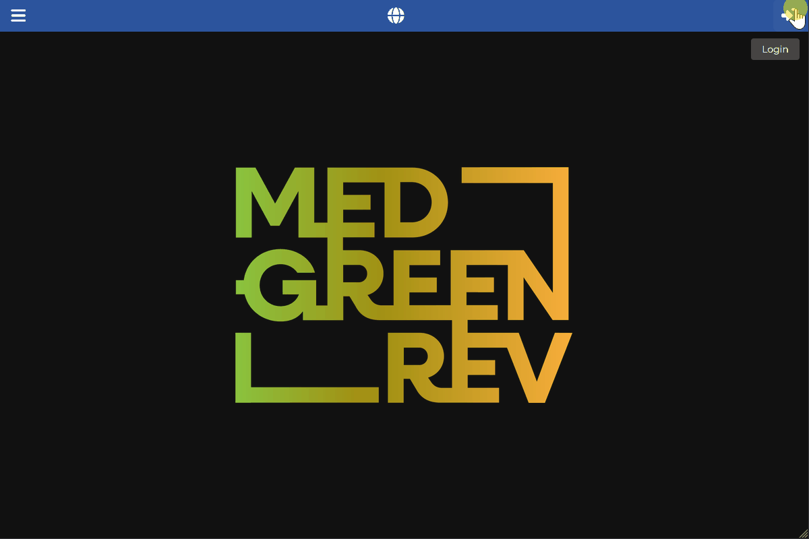

[Back to User Documentation](index.md)

# Context Management

This document describes how contexts are managed within the MEDGREENREV system.

## Context creation

### Permissions

See the dedicated [Site permissions paragraph](site-permissions-management.md) document for more information.

### Steps

1.  Navigate to the **Data / Archaeology / Sites** section using the left-hand navigation menu.
2.  Select the site you want to manage, possibly using the search bar, and click on the right-sided arrow on the left side of the row to navigate to the site's details page.
3.  Click the **Contexts** tab.
4.  Click the vertical **...** button in the top bar and select the **add new** option in the dropdown menu.
5.  Fill in the form, keeping in mind the required fields and any validation rules.
    The `stratigraphic_unit` field is mandatory and must exist before the context creation. The SU is chosen from a dropdown list containing all the stratigraphic units of the site. You can filter the list by typing a few letters/numbers of the unit code.
    The **Code** field is automatically generated from the context information.
6.  Click the **Submit** button.

### Further SU associations

Contexts can be associated with more than one SU. To associate a new SU:

1. Navigate to the context's details page, using either **Data / Archaeology / Contexts**, possibly filtering it with the search bar, or the parent site's detail page in the context tab.
2. Select the **Stratigraphic units** tab.
3. Click the vertical **...** button in the top bar and select the **add new** option in the dropdown menu.
4. Fill in the form, keeping in mind the required fields and any validation rules.
   The `stratigraphic_unit` field is mandatory and must exist before the association creation. The SU is chosen from a dropdown list containing all the stratigraphic units of the site. You can filter the list by typing a few letters/numbers of the unit code.
5. Click the **Submit** button.

### Visual Guide

The following GIF demonstrates the process for both operations:

## Analyses association

Contexts can be associated with context-based analyses. See the dedicated [Analyses](analyses.md) document for more information.
