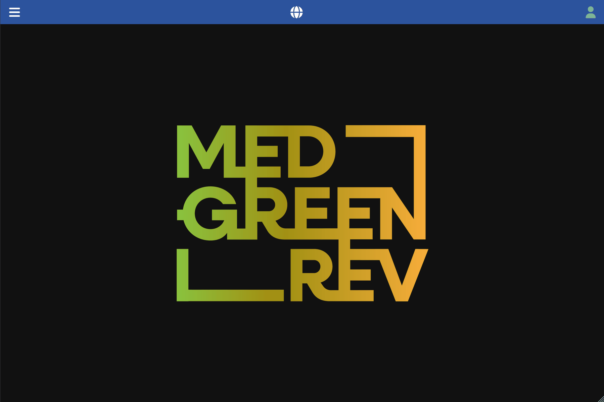
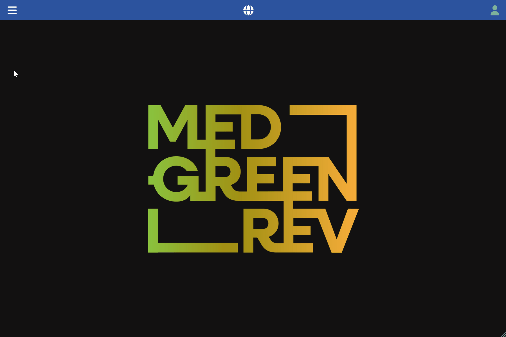

[Back to User Documentation](index.md)

# Media Management

This document describes how media are managed within the MEDGREENREV system.

## Media creation

### Permissions

Any fully authenticated user can upload media. See the [Authorization](authorization.md#media-objects-uploads) document for more information.
The maximum file size is 10MB maximum. 

### Steps

1.  Navigate to the **Media / Media** section using the left-hand navigation menu.
2.  Click the vertical **...** button in the top bar and select the **add new** option in the dropdown menu.
3.  Fill in the form, keeping in mind the required fields and any validation rules.
4.  Click the **Submit** button.

## Media association

Media can be associated with various resources in the system. The following table lists all resources that support media association:

| Resource |
|---|
| Analysis |
| Pottery |
| Stratigraphic unit |
| Sampling stratigraphic unit |
| Paleoclimate sample |
| Paleoclimate sampling site |
| Location (historical data) |

To associate a media with a resource:

1. Navigate to the relevant resource details page section using the left-hand navigation menu.
2. Select the **Media** tab.
3. Click the **+** button in the tab window.
4. Select the media to associate by browsing the file system or by dragging and dropping the media. In the case of media association, the media does not necessarily need to be uploaded before the association is created. If the media is not yet uploaded to the system, fill in the form as described in the Media creation section.
   If the media is already uploaded, the app recognizes it and automatically forwards the necessary information for the association to the server.
5. Click the **Submit** button.

### Visual Guide

The following GIF demonstrates the process for both the aforementioned cases:

