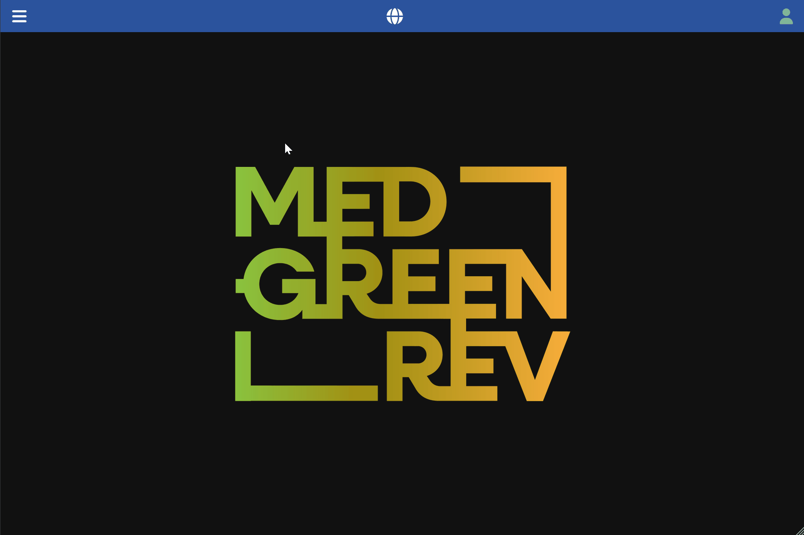

[Back to User Documentation](index.md)

# Micro Stratigraphic Unit Management

This document describes how stratigraphic units are managed within the MEDGREENREV system.

## MU creation

### Permissions

User must have the editing permission on the site (see the [Authorization](authorization.md#specialist-data-items-botany-zoo-pottery-etc) and [Site permissions](site-permissions-management.md) documents for more information) and the `microstratigraphist` role to be able to create a new MU.

### Steps

1.  Navigate to the parent **Stratigraphic Unit** details page.
2.  Click the **MUs** tab.
3.  Click the vertical **...** button in the top bar and select the **add new** option in the dropdown menu.
4.  Fill in the form, keeping in mind the required fields and any validation rules.
    The **Code** field is automatically generated concatenating the `SU` code, and the `identifier` (e.g. in the example below it will be `TO.25.310.a`). 
5.  Click the **Submit** button.

### Visual Guide

The following GIF demonstrates the process:

)
