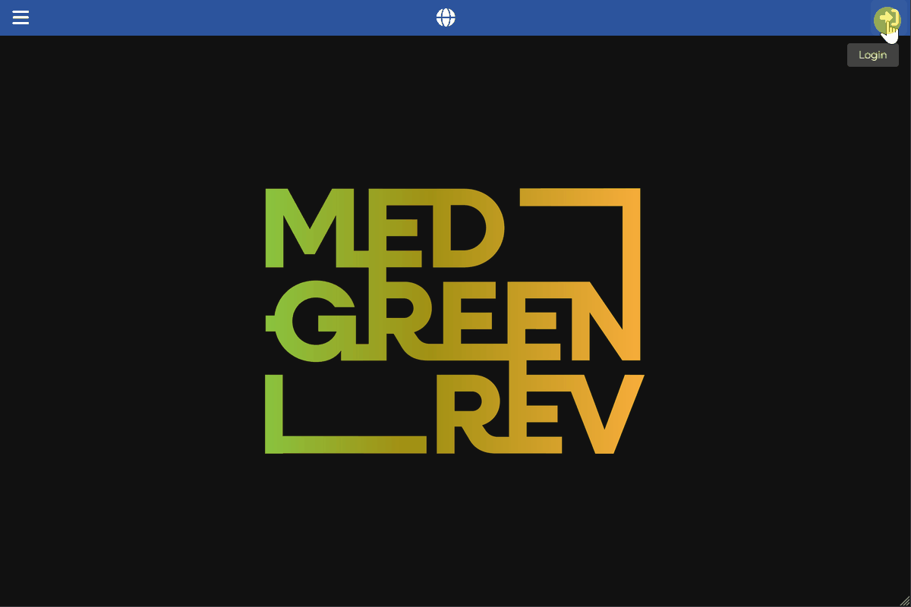

[Back to User Documentation](index.md)
# Paleoclimate Management
This document describes how paleoclimate data is managed within the MEDGREENREV system.
## Table of Contents
- [Sampling site](#sampling-site)
  - [Permissions](#permissions)
  - [Procedure](#procedure)
  - [Visual Guide](#visual-guide)
- [Sample](#sample)
  - [Permissions](#permissions-1)
  - [Creation Procedure](#procedure-1)
    - [Primary Procedure: From the Paleoclimate Samples Collection](#primary-procedure-samples)
    - [Alternative Procedure: From Paleoclimate Sampling Site](#alternative-procedure-samples)
  - [Visual Guide](#visual-guide-1)

## Sampling site
### Permissions
As an authenticated user with the paleoclimatologist role (editor), you can create a new paleoclimate sampling site entry. See the [Authorization](authorization.md) document for more information.
### Procedure
1. Navigate to the **Data / Paleoclimate / Sites (sampling)** section using the left-hand navigation menu.
2. Click the vertical **...** button in the top bar and select the **add new** option in the dropdown menu.
3. Fill in the form, keeping in mind the required fields and any validation rules:
    - **Code**: A unique identifier for the sampling site (automatically converted to uppercase).
    - **Name**: The unique name of the site (automatically capitalized).
    - **Region**: Selected from the regions autocomplete dropdown list.
    - **Coordinates (N, E)**: Decimal degrees in WGS84 (EPSG:4326). Both coordinates must be either present or absent.
    - **Description**: Additional descriptive information about the location.
4. Click the **Submit** button.
### Visual Guide
The following GIF demonstrates the process:

## Sample
### Permissions
As an authenticated user with the paleoclimatologist role, you can create a new paleoclimate sample entry. See the [Authorization](authorization.md) document for more information.
### Creation Procedure
There are two ways to create a new paleoclimate sample entry:

#### Primary Procedure: From the Paleoclimate Samples Collection
1. Navigate to the **Data / Paleoclimate / Samples** section using the left-hand navigation menu.
2. Click the vertical **...** button in the top bar and select the **add new** option in the dropdown menu.
3. Fill in the form:
    - Select the **Site** from the autocomplete dropdown list.
    - Enter the **Number** (required integer; the combination of site and number must be unique).
    - Provide the **Chronology (Lower)** and **Chronology (Upper)** bounds (lower chronology must be greater than or equal to upper chronology).
    - Enter a **Description** if needed.
    - Select the applicable data and analysis record checkboxes (**precipitations**, **temperature**, **fluid inclusions**, **petrographic descriptions**, **stable isotopes**, **trace elements**).
4. Click the **Submit** button.

#### Alternative Procedure: From Paleoclimate Sampling Site
Alternatively, you can create a sample entry directly associated with a specific paleoclimate sampling site:
1. Navigate to the **Data / Paleoclimate / Sites (sampling)** section using the left-hand navigation menu.
2. Select the required paleoclimate sampling site to open its details page.
3. Choose the **Samples** tab.
4. Click the vertical **...** button in the top bar and select the **add new** option in the dropdown menu.
5. Fill in the form. The **Site** field in the create dialog is automatically populated with the correct sampling site (and disabled for editing).
    - Enter the **Number** (required integer; the combination of site and number must be unique).
    - Provide the remaining fields and validation rules (Chronology Lower/Upper, Description, and analysis record checkboxes).
6. Click the **Submit** button.
### Visual Guide
The following GIFs demonstrate the process:

- **Creation from the Samples Collection**:

- **Creation from Paleoclimate Sampling Site (Location)**:

