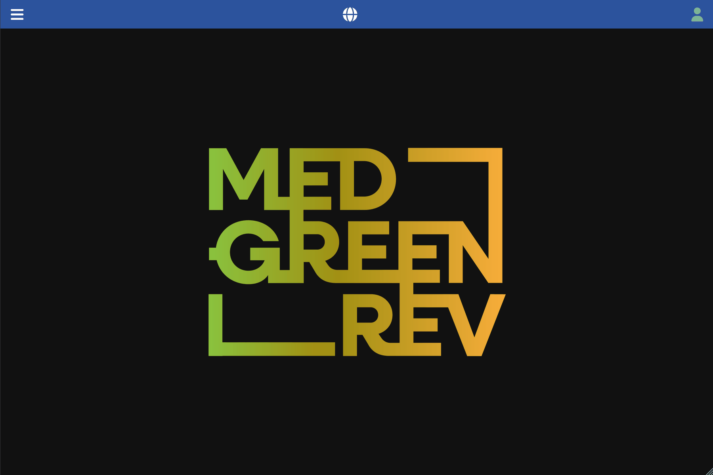

[Back to User Documentation](index.md)

# Sample Management

This document describes how stratigraphic units are managed within the MEDGREENREV system.

## Sample creation

### Permissions

See the dedicated [Site permissions paragraph](site-permissions-management.md) document for more information.

### Steps

1.  Navigate to the **Data / Archaeology / Sites** section using the left-hand navigation menu.
2.  Select the site you want to manage, possibly using the search bar, and click on the right-sided arrow on the left side of the row to navigate to the site's details page.
3.  Click the **Samples** tab.
4.  Click the vertical **...** button in the top bar and select the **add new** option in the dropdown menu.
5.  Fill in the form, keeping in mind the required fields and any validation rules.
The `stratigraphic_unit` field is mandatory and must exist beforehand the sample creation. SU is chosen from a dropdown list containing all the stratigraphic units of the site. you can filter the list by typing a few letters/numbers of the unit code.
The **Code** field is automatically generated concatenating the `site` code, the `type` code, last two digits the `year` last two digits, and the `number` (e.g. in the example below it will be `TO.MM.26.5`).
6.  Click the **Submit** button.

### Further SU associations

Samples can be associated with more than one SU, to associate new SU:
1. Navigate to the sample's details page, using either the **Data / Archaeology / Samples**, possibly filtering it with the search bar,
or in the parent site's detail page in the sample tab.
2. Select the **Stratigraphic units** tab.
3. Click the vertical **...** button in the top bar and select the **add new** option in the dropdown menu.
4. Fill in the form, keeping in mind the required fields and any validation rules.
The `stratigraphic_unit` field is mandatory and must exist beforehand the association creation. SU is chosen from a dropdown list containing all the stratigraphic units of the site. You can filter the list by typing a few letters/numbers of the unit code.
5. Click the **Submit** button.

### Visual Guide

The following GIF demonstrates the process for both the operations:

## Analyses association

Sample can be associated with .
