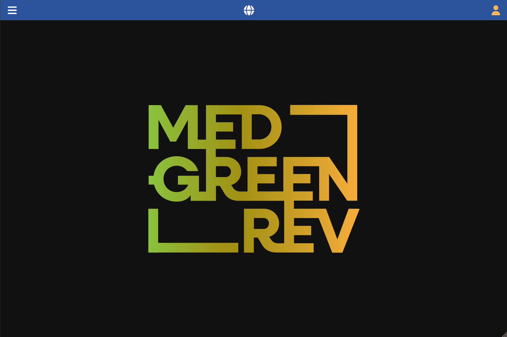

[Back to User Documentation](index.md)

# Site Permissions Management

This document provides a template for managing site-specific permissions within the MEDGREENREV system.

## Overview

Access to archaeological data is managed through site-specific privileges, ensuring that only authorized users can modify records related to a particular site.

### Permission Levels

As defined in the [Authorization and Security Policies](authorization.md#general-principles), there are two primary site-specific privilege levels:

*   **User**: Allows general data management (Contexts, Stratigraphic Units, Samples, etc.).
*   **Editor**: Required for modifying or deleting the **Archaeological Site** record itself.

## How to Manage Site User Privileges

As an admin user or creator of the site to grant or modify access for a user on a specific site:

1.  Navigate to the **Data / Archaeology / Sites** section using the left-hand navigation menu.
2.  Select the site you want to manage, possibly using the search bar, and click on the right-sided arrow on the left side of the row.
3.  Click the **User Privileges** tab. 
4.  Click the vertical **...** button in the top bar of the tab content and select the **add new** option in the dropdown menu.
5.  Select the user you want to grant editing to the site from the dropdown list.

### Visual Guide

The following GIF demonstrates the process of managing site user privileges:

## Security Rules

*   **Read**: Requires `ROLE_ADMIN` or `ROLE_EDITOR`.
*   **Create / Update / Delete**: Requires `ROLE_ADMIN` OR all of the following:
    *   The user must have `ROLE_EDITOR`.
    *   The user must be the original creator of the site.
    *   The user cannot change their own privileges.

For more details, refer to the [Authorization and Security Policies](authorization.md#site-user-privileges-managing-access).
