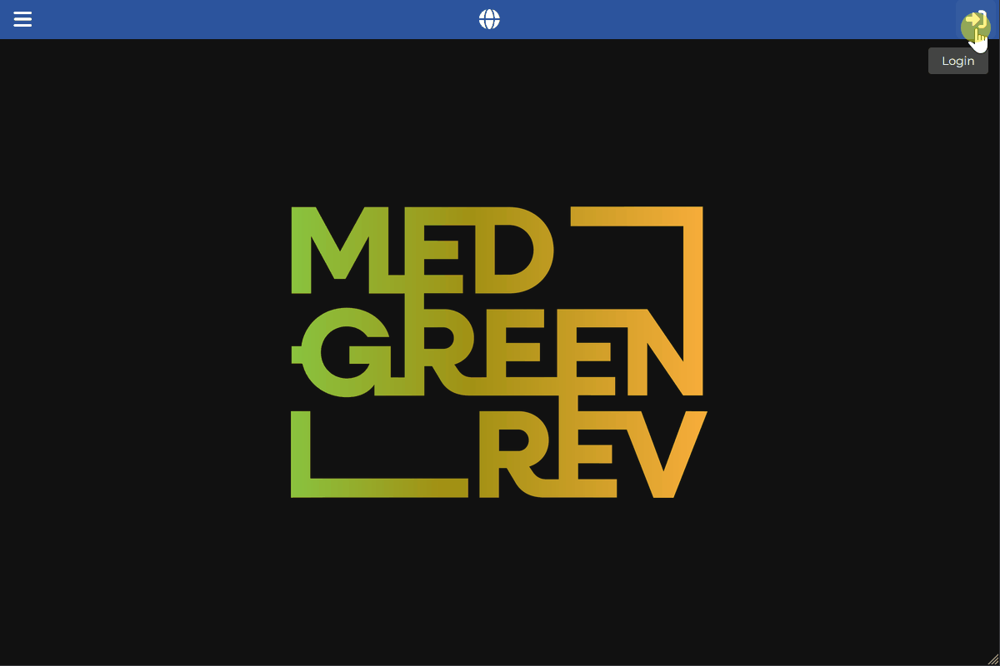

[Back to User Documentation](index.md)

# Stratigraphic Relationship Management

This document describes how stratigraphic relationships between stratigraphic units are managed within the MEDGREENREV system.

## Stratigraphic relationship management

### Permissions

Managing stratigraphic unit relationships requires authentication and site permissions (requiring `ROLE_ADMIN` or site-specific **User** privileges). See the [Authorization](authorization.md#stratigraphic-unit-relationships) and [Site permissions](site-permissions-management.md) documents for more information.

### Steps

1. Navigate to the relevant Stratigraphic Unit (SU) details page (either via the **Data / Archaeology / Sites** section by selecting the site and its **Stratigraphic Units** tab, or directly via **Data / Archaeology / Stratigraphic Units**).
2. Click the **Relationships** tab.
3. Enable editing by clicking on the lock icon button in the top right corner.
4. Select the relation you want to add (e.g. "cover to") and click the plus button (**+**) on the corresponding relationship card to open the relationship dialog.
5. In the dialog, choose the related SU from the dropdown/autocomplete list and click the **Submit** button.
   Self-referencing relationships and duplicate relationships are not allowed.
6. The new related SU will be shown in the correct relation box. Related SUs can be investigated or navigated to by clicking on their identifier chip.
7. Related SUs can be deleted by clicking the red **x** button on the chip (visible when in editing mode) and confirming the deletion in the confirmation dialog.

### Visual Guide

The following GIF demonstrates the process:

