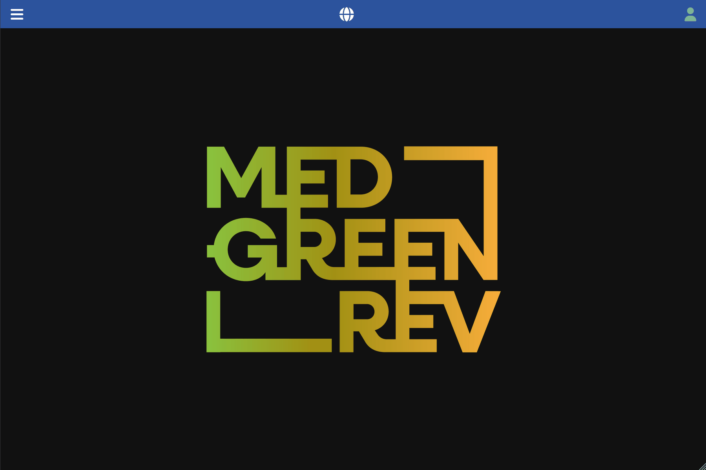

[Back to User Documentation](index.md)

# Stratigraphic Unit Management

This document describes how stratigraphic units are managed within the MEDGREENREV system.

## SU creation

### Permissions

See the [Authorization](authorization.md#stratigraphic-units-su) and [Site permissions](site-permissions-management.md) documents for more information.

### Steps

1.  Navigate to the **Data / Archaeology / Sites** section using the left-hand navigation menu.
2.  Select the site you want to manage, possibly using the search bar, and click on the right-sided arrow on the left side of the row to navigate to the site's details page.
3.  Click the **Stratigraphic Units** tab.
4.  Click the vertical **...** button in the top bar and select the **add new** option in the dropdown menu.
5.  Fill in the form, keeping in mind the required fields and any validation rules.
    The **Code** field is automatically generated concatenating the `site` code, the `year` last two digits, and the `number` (e.g. in the example below it will be `TO.26.23`). 
6.  Click the **Submit** button.

### Visual Guide

The following GIF demonstrates the process:

)
